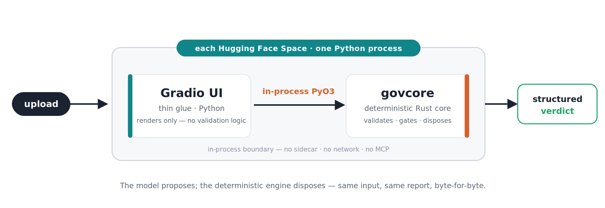
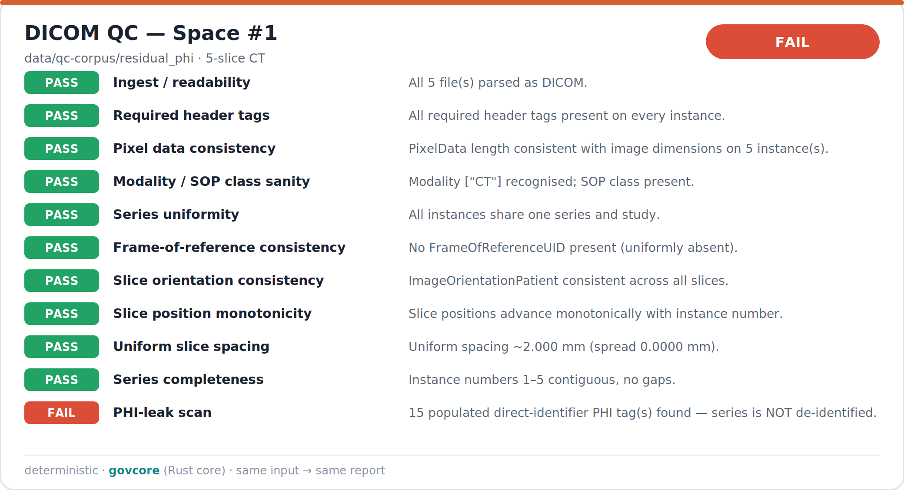
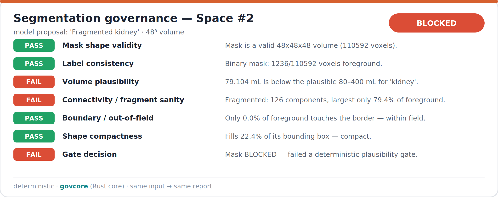
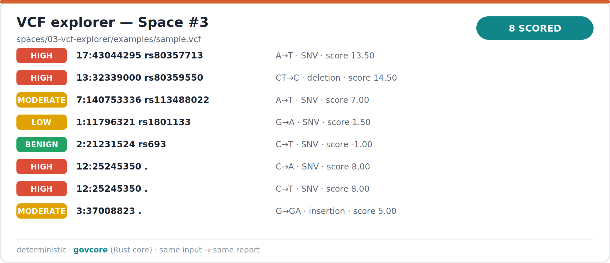

<p align="center">
  
</p>

<p align="center">
  <b>A deterministic Rust core governs the I/O and output of probabilistic
  medical-imaging / genomics models.</b><br>
  Model proposes, deterministic engine disposes.
</p>

<p align="center">
  <a href="https://github.com/NahButch/imaging-governance/actions/workflows/ci.yml"></a>
  <a href="LICENSE"></a>
</p>

Three independent [Hugging Face Spaces](https://huggingface.co/spaces) share one thesis and one engine: every
probabilistic step (a scanner, a segmentation network, a variant caller) hands
its output to a single deterministic Rust crate — [`govcore`](crates/govcore) —
which validates and gates it with pure, ordered, **unit-tested** logic. The
verdict is reproducible byte-for-byte. Python is glue only; no validation logic
lives outside Rust.

## The boundary

<p align="center">
  
</p>

The Rust↔Python boundary is **in-process PyO3**, compiled with `maturin` — no
sidecar, no MCP, no network call. That is the only boundary that deploys cleanly
into a single-process [Hugging Face](https://huggingface.co) Gradio Space, and it
keeps the deterministic core as the credential.

## The three Spaces

| # | Space | Thesis in one line | `govcore` entry point | Status |
|---|-------|--------------------|-----------------------|--------|
| 1 | [`01-dicom-qc`](spaces/01-dicom-qc) | Validate a DICOM series — geometry, completeness, header conformance, residual PHI | `qc_series` | ✅ shippable |
| 2 | [`02-seg-governance`](spaces/02-seg-governance) | Gate a model's segmentation mask on plausibility before downstream use | `postcheck_segmentation` | ✅ shippable |
| 3 | [`03-vcf-explorer`](spaces/03-vcf-explorer) | Score VCF variants with a transparent, auditable weighted-evidence model | `score_vcf` | ✅ shippable |

Each Space is **independently deployable** as a Docker SDK Space; a stall in one
never blocks shipping another. The shared core is vendored into each Space's
build context at deploy time (see [`scripts/deploy_space.sh`](scripts/deploy_space.sh)).

## Gallery

Real `govcore` output, rendered directly from the Rust core
([`scripts/render_gallery.py`](scripts/render_gallery.py)) — not mock-ups.

**Space #1 — DICOM QC** flags residual PHI on a corpus fixture (overall FAIL):



**Space #2 — segmentation governance** blocks an implausible model mask:



**Space #3 — VCF explorer** scores each variant with auditable provenance:



## The deterministic core — `govcore`

A single Rust crate, three modules, exposed to Python as a native extension. Each
module emits the same auditable shape — per-check `{status, detail, evidence}`
with a deterministic ordering and an overall verdict (the worst status).

**[`dicom_qc.rs`](crates/govcore/src/dicom_qc.rs)** — DICOM series QC on `dicom-rs`:
ingest readability, required-tag completeness, pixel-data consistency
(length vs `Rows×Cols×bits`), modality/SOP sanity, series uniformity,
frame-of-reference consistency, slice orientation, monotonic position, uniform
spacing, instance-number completeness, and a PHI-leak scan (direct vs quasi
identifiers + private tags).

**[`seg_postcheck.rs`](crates/govcore/src/seg_postcheck.rs)** — segmentation
plausibility gates: shape validity, label consistency, anatomical volume bounds,
6-connectivity fragment sanity, out-of-field clipping, bounding-box compactness —
plus a terminal binary **gate decision**.

**[`vcf_score.rs`](crates/govcore/src/vcf_score.rs)** — VCF parsing
(multi-allelic aware) + weighted-evidence scoring. Each variant's score is the
sum of named components — consequence/impact (with frameshift bonus), rarity,
clinical significance, quality/filter, catalog membership, and allele validity —
each carrying its provenance; the weight table ships in the report.

The validator is checked against a synthetic, **labeled** ground-truth corpus
([`data/qc-corpus`](data/qc-corpus)) — every fixture's intended defect is matched
by the engine's verdict ([`scripts/eval_corpus.py`](scripts/eval_corpus.py)). No
real patient data anywhere; all fixtures are synthetic.

### Why it holds together

- **One contract.** Every module returns the same `Report` shape, so the three
  Spaces render identically and any consumer parses one schema. Checks are
  emitted in a fixed order and the verdict is the worst status — no hidden
  precedence.
- **Determinism as the credential.** No learned parameters, no randomness, no
  clock: identical bytes in produce an identical report out. That is what makes
  the output auditable and regression-testable (28 Rust unit tests + a
  label-matched corpus).
- **The boundary is the deploy story.** Because the core is an in-process PyO3
  extension, each Space is a single Python process that imports it — nothing to
  orchestrate. [`deploy_space.sh`](scripts/deploy_space.sh) vendors the workspace
  into the Space's Docker context so the same crate builds in every Space while
  each stays independently shippable.

## Quick start

```bash
# Rust core tests (no Python needed)
cargo test --manifest-path crates/govcore/Cargo.toml

# Build the govcore Python extension into a venv
python -m venv .venv && . .venv/bin/activate
pip install maturin gradio numpy pillow pydicom
scripts/build_govcore.sh

# Prove the boundary + corpus labels + every Space
python scripts/smoke_import.py
python scripts/eval_corpus.py
python scripts/space_smoke.py

# Run a Space locally (CPU-only)
python spaces/01-dicom-qc/app.py        # http://localhost:7860
```

## Layout

```
crates/govcore/       deterministic Rust core (PyO3 module)
spaces/01-dicom-qc/   Space #1 — DICOM QC
spaces/02-seg-governance/  Space #2 — segmentation governance
spaces/03-vcf-explorer/    Space #3 — VCF explorer
data/qc-corpus/       synthetic labeled ground-truth fixtures + manifest
scripts/              build / generate / eval / deploy helpers
.github/workflows/    CI: cargo test + PyO3 smoke + corpus eval + Space smoke
```

## Guarantees

- CPU-only, free-tier-friendly; no GPU or network model dependency.
- Deterministic: same input → same report, byte-for-byte.
- All validation logic in Rust, unit-tested (28 core tests); Python is glue.
- No PHI / real patient data — synthetic fixtures with a labeling manifest.

## License

[MIT](LICENSE).
